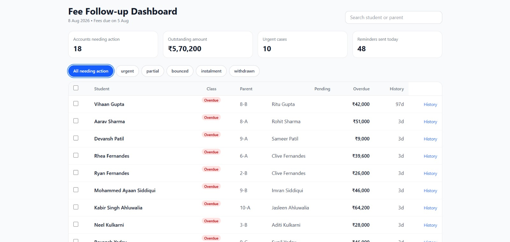
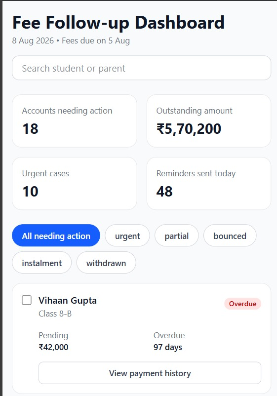
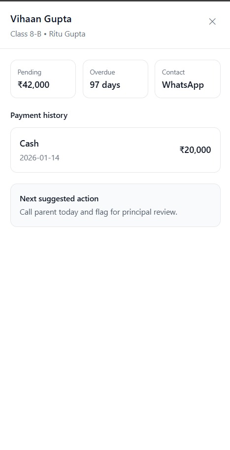
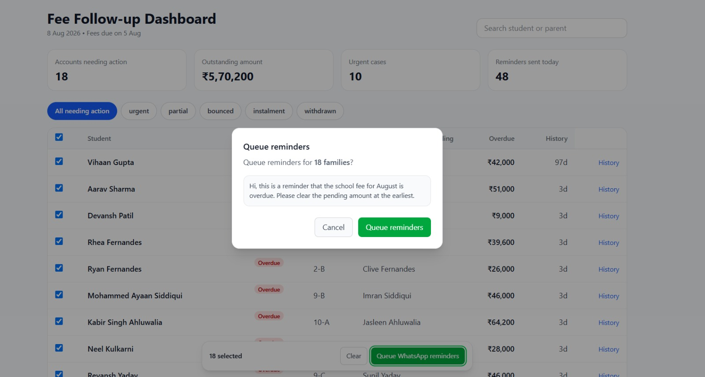

# Fee Follow-up Dashboard

A responsive React + TypeScript dashboard designed for a school accounts operator to review overdue fees, prioritize follow-ups, and queue WhatsApp reminders with minimal clicks.

## Screenshots

### Desktop Dashboard

# Dashboard Desktop view
# Video Recording
<video controls src="20260809-2013-32.5978732.mp4" title="Title"></video>

# Screenshot


# Mobile view


# Payment History


# Reminder Modal


## Problem

Lakshmi, the school accounts operator, needs a quick way to:

* see which families require action,
* identify urgent overdue accounts,
* review payment history,
* and send reminder messages in bulk.

The dashboard is optimized for that daily workflow rather than for generic analytics.

---

## Tech Stack

* **React 19**
* **TypeScript**
* **Vite**
* **Tailwind CSS**

---

## Key Features

* Search by **student** or **parent**
* Status filters: **Urgent, Partial, Bounced, Instalment, Withdrawn**
* Sticky bulk-action bar
* Select-all workflow
* Payment-history side drawer
* Responsive mobile cards
* Keyboard support (`Esc` closes overlays)

---

## Interaction Efficiency

Queue reminders for all visible defaulters in **3 clicks**:

1. Select all visible
2. Queue WhatsApp reminders
3. Confirm

This directly addresses the assignment requirement of minimizing interaction cost.

---

## Awkward Records Handled

| Record          | Label          |
| --------------- | -------------- |
| Credit balance  | **Credit**     |
| Instalment plan | **Instalment** |
| Bounced cheque  | **Bounced**    |

Sibling accounts are marked with **“Chase family once”** to avoid duplicate outreach.

---

## Responsive Design

### Desktop

* Summary metrics
* Filter chips
* Full table with bulk actions

### Mobile

* Stacked student cards
* Status badge
* Amount due
* Overdue days
* One-tap payment history

Dropped on mobile: detailed notes, fee-component breakdowns, and reminder metadata.

---

## Project Structure

```text
src/
├─ components/
│  ├─ Header.tsx
│  ├─ SummaryCard.tsx
│  ├─ StudentTable.tsx
│  ├─ MobileCards.tsx
│  ├─ BulkActionBar.tsx
│  ├─ ReminderModal.tsx
│  ├─ PaymentDrawer.tsx
│  └─ states/
│     ├─ LoadingState.tsx
│     └─ ErrorState.tsx
├─ data/
│  └─ students.json
├─ App.tsx
├─ main.tsx
└─ types.ts
```

---

## Getting Started

### Install dependencies

```bash
npm install
```

### Run locally

```bash
npm run dev
```

Open the URL shown in the terminal (usually `http://localhost:5173`).

### Build

```bash
npm run build
```

---


---

## Design Decisions

A detailed explanation of visual hierarchy, awkward records, mobile trade-offs, interaction path, and rejected ideas is included in **`RATIONALE.md`**.

---

## What I Optimized

* Fast scan time
* Low click count
* Clear status signaling
* Reusable component structure
* Maintainable state management

---

## Submission Notes

* Dataset preserved from the assignment.
* No external UI library used.
* Components extracted for readability and maintainability.
